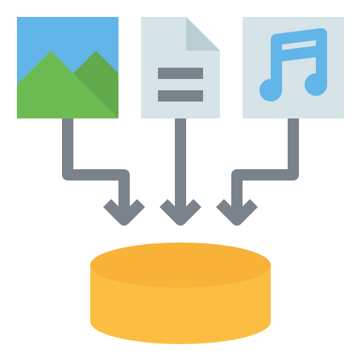

# Python을 활용한 데이터 수집 1

## 프로젝트 목표
- Python 기본 문법 습득
- 파일 입출력에 대한 이해
- 데이터 구조에 대한 분석과 이해
- 데이터를 가공하고 JSON 형태로 구성하기

## Aladin API
> 커뮤니티 서비스 개발을 위한 데이터 구성 단계로, 필요한 도서 데이터를 직접 추출하고 구성하는 과정

---
### A. 제공되는 아티스트 데이터의 주요내용 수집 

#### 1. 학습한 내용
- **`get()`** 함수를 활용해서 **key에 대응되는 value를 리턴**하는 방법
  
  - 특징
    - 딕셔너리에 존재하지 않는 키로 값을 가지고 오려고 하면, '[ ]'로 접근할 때에는 오류를 발생시키지만 get()은 None을 리턴한다.
    - get(x, '디폴트 값'): 딕셔너리 안에 key가 없을 경우, 미리 정해 둔 디폴트 값을 대신 가져오게 할 수 있다.

#### 2. 새로 배운 것들 및 느낀 점
- 코드가 잘못 구현되었을 때, **오류를 내는 게 좋은가 어떻게든 프로그램이 돌아가도록 구성하는게 더 좋은 것**인지 고민해보았다. 
  - `[ ]` 
    - 문법 간단
    - 'KeyError'가 발생해 프로그램이 중단되니까 어디서 코드가 잘못된 건지 바로 알 수 있어 좋은 거 같다.
    - 예외 처리를 따로 해줘야 한다.
  - `get()` 
    - 서비스를 출시했을때 프로그램이 아예 종료되는 것보다는 어떻게든 진행되는 게 좋지 않을까라는 생각
    - 잘못된 키 값에 접근하는 것에 특정한 의미를 주고 싶을 때 쓰면 좋을 듯
---
### B. 제공되는 도서 데이터의 주요내용 수집 

#### 1. 학습한 내용
- **딕셔너리 리스트**에서 원하는 값을 추출하고 가공하는 방법

#### 2. 어려웠던 부분
- 리스트의 요소로 딕셔너리 그자체가 들어간 것을 제대로 이해하지 못하고 리스트 안의 요소를 자꾸 키로 접근하려고 했다.
- 리스트의 요소(딕셔너리) -> 딕셔너리의 요소(키와 값)의 구조를 이해하고 나서야 `categories.json`에서 `id`와 `name`의 값을 잘 가져올 수 있었다.
---
### C. 다중 데이터 분석 및 수정 

#### 1. 어려웠던 부분
- 여러 .json 파일과 데이터들을 다루려니 **원하는 값에 접근하는 부분**이 조금 헷갈렸다.
- 침착하게 데이터가 저장된 형식을 생각하고 따져보니 문제를 풀 수 있었다.

---
### D. 알고리즘을 사용한 데이터 출력

#### 1. 학습한 내용
- **JSON**이 무엇인지
  - 자바스크립트 객체 표기법
  - 경량의 텍스트 기반의 데이터 형식
  - 데이터 표현 방법
- **json 파일을 다루는 방법**
  - open() : 파일 열기
  - load() : 이미 열린 파일에서 **JSON 데이터 읽어**와서 Python 데이터 구조로 변환

#### 2. 어려웠던 부분
- `books`폴더 안에 있는 파일들을 어떻게 읽어올지 고민을 했다.
  - 서치하다 찾은 `os`모듈을 import해서 해야하나 했는데 알고보니 `books.json`안에 있는 `id` 키 값과 필요한 파일의 제목들이 연관이 있다는 사실을 알게 되었다.
  - `f-string`방법을 파일 경로에도 쓸 수 있어 신기했다.
- 딕셔너리 리스트를 어떻게 정렬할지 많은 고민을 했다.
  - `sorted()`내장함수와 `lambda`함수를 사용해 정렬 기준을 리스트 요소인 딕셔너리의 키로 정할 수 있었다.

## Spotify API
> 커뮤니티 서비스 개발을 위한 데이터 구성 단계로, 필요한 아티스트 데이터를 직접 추출하고 구성하는 과정

---
### E. 알고리즘을 사용한 데이터 출력 

#### 1. 학습한 내용
- 데이터를 보기 좋게 출력하는 **pprint**모듈에 대해 학습
#### 2. 새로 배운 것들 및 느낀 점
- pprint.pprint를 print()로 사용하기 위해 `from`, `import`, `as`라는 키워드를 사용하며 각각이 어떤 역할을 하는지 알게 되었다.